<!--
  ============================================================
  OPTIMUS PRIME G1 — Fusion 360 Simulation Engine
  Description: Open-source Python script that builds a 3D-printable
    Optimus Prime G1 robot in Autodesk Fusion 360 and runs 9
    kinematic simulation modules via MCP protocol.
  Keywords: Optimus Prime, Transformers, Fusion 360, MCP, 3D printing,
    robotics simulation, G1, kinematic simulation, Python, CAD,
    STL export, URDF, Model Context Protocol, FDM printing
  Author: itsPremkumar
  Repository: https://github.com/itsPremkumar/Optimus_Prime
  License: MIT
  ============================================================
-->

# Optimus Prime G1 — Full Simulation Engine v9.0

[](LICENSE)
[](https://python.org)
[](https://www.autodesk.com/products/fusion-360)
[](CONTRIBUTING.md)
[](https://github.com/itsPremkumar/Optimus_Prime)
[](https://www.conventionalcommits.org)

An open-source **Autodesk Fusion 360 simulation suite** that programmatically builds a fully-articulated, **3D-printable Optimus Prime G1** robot and runs a **9-module kinematic simulation** — all driven remotely via the **Model Context Protocol (MCP)**.

This project brings the legendary Autobots leader from the **Transformers** franchise to life — from the 1984 **Generation 1** animated series and the live-action movie designs — as the **first fully working 3D-printable CAD model** of Optimus Prime with complete **servo-driven kinematic simulation**, **robot-to-truck transformation**, and **FDM-printable hardware integration**.

### Truck Mode — Multi-Angle Renders

| Front | Back | Left |
|-------|------|------|
| 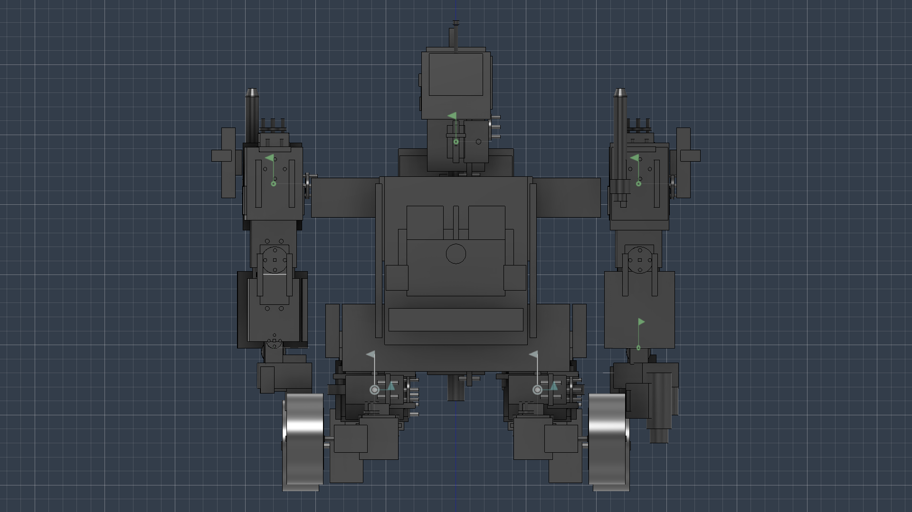 | 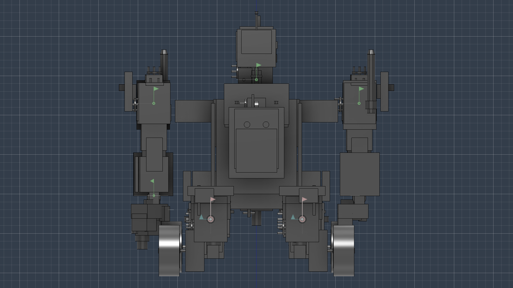 | 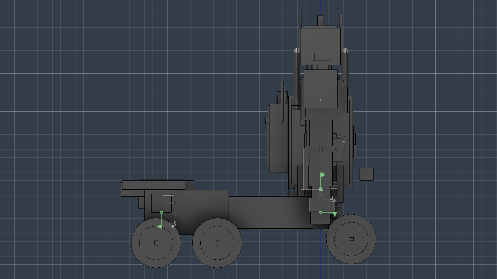 |

| Right | Top | Isometric |
|-------|-----|-----------|
| 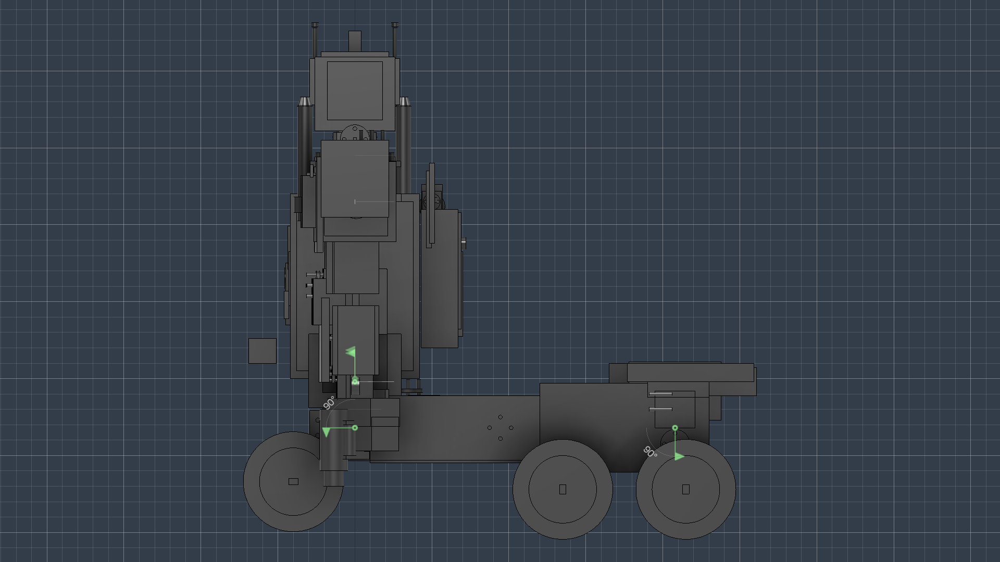 | 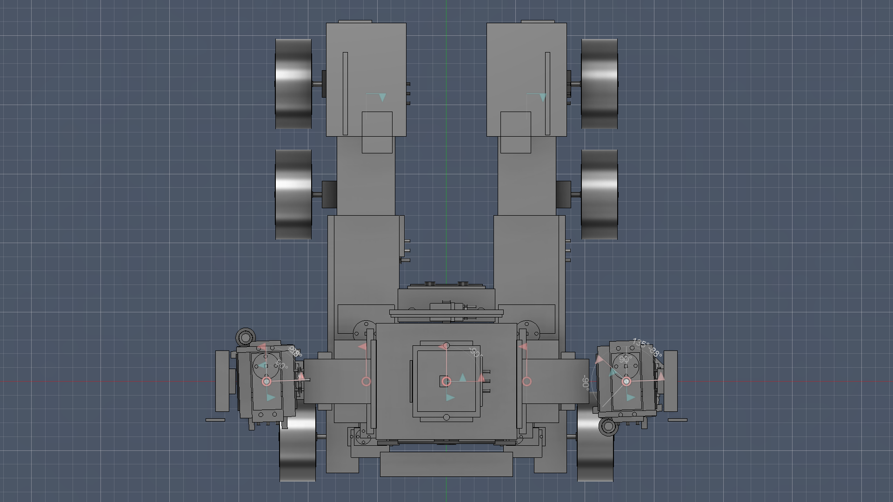 | 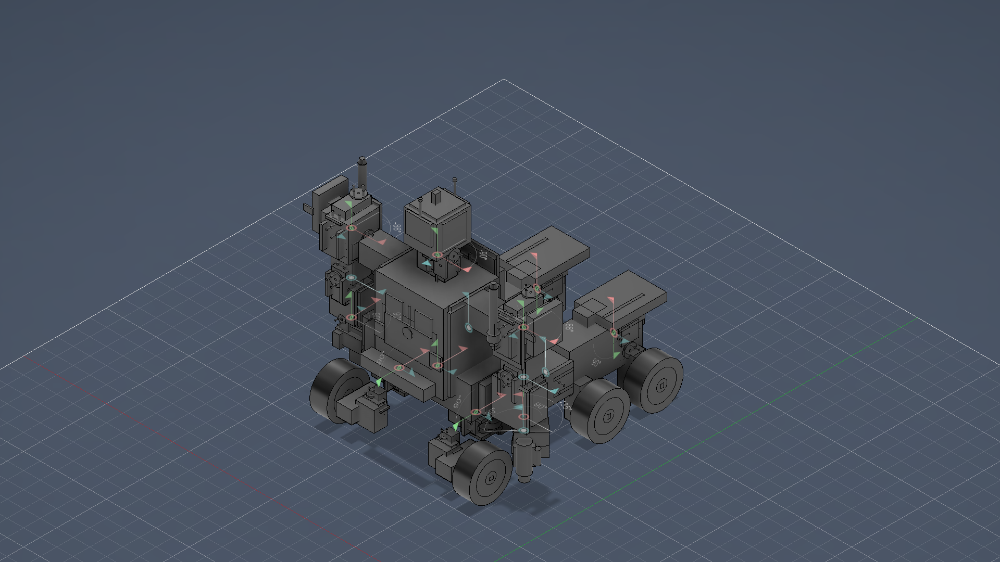 |

### Robot Mode — Multi-Angle Renders

| Front | Back | Left |
|-------|------|------|
| 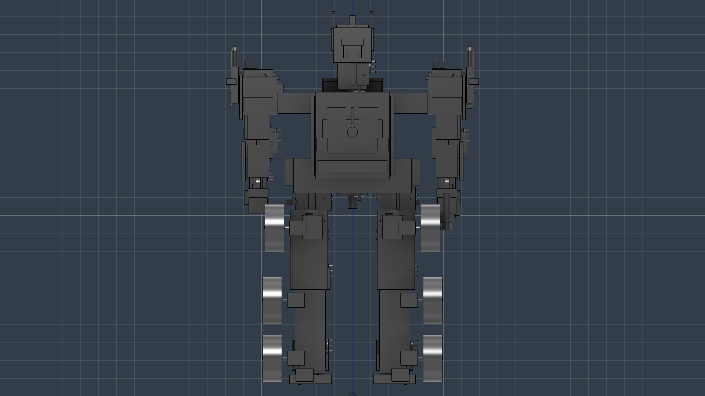 | 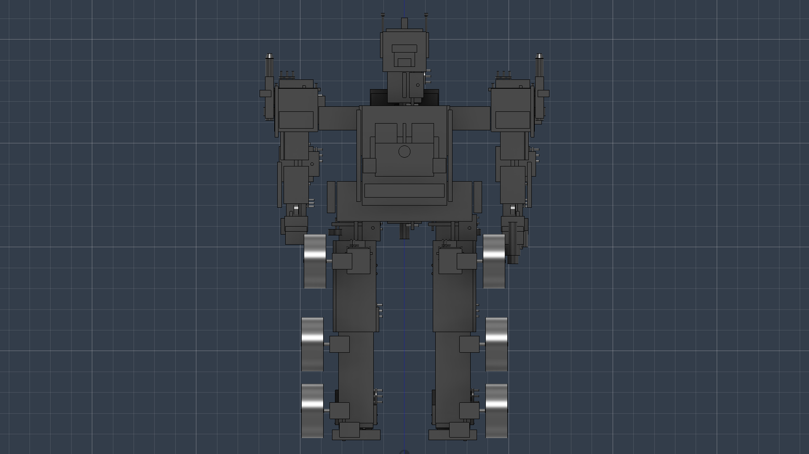 | 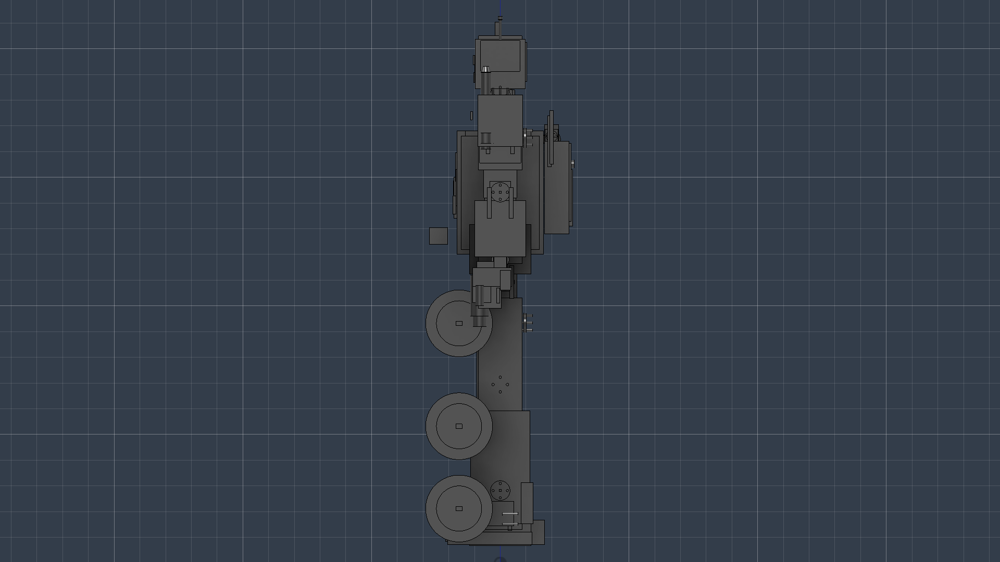 |

| Right | Top | Isometric |
|-------|-----|-----------|
| 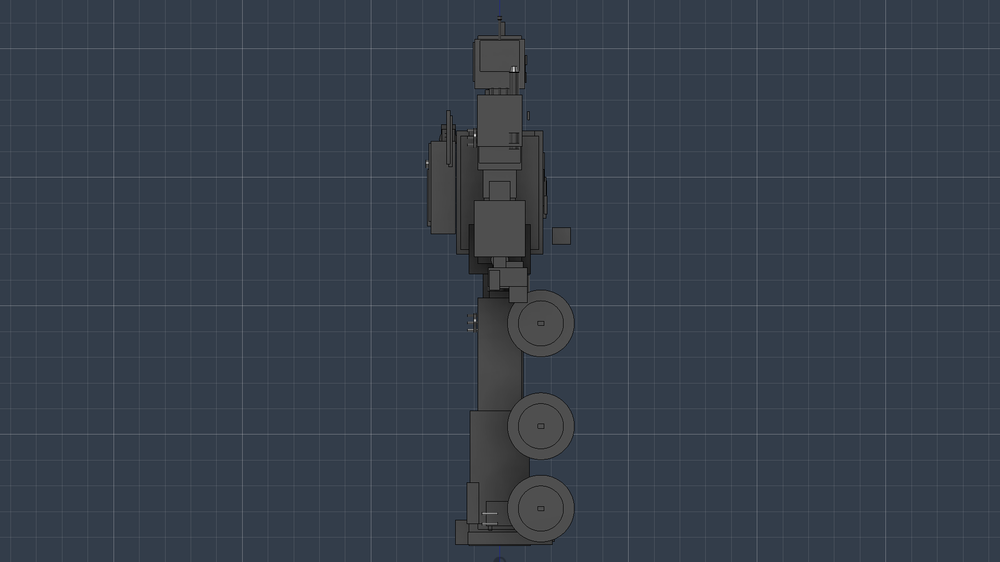 | 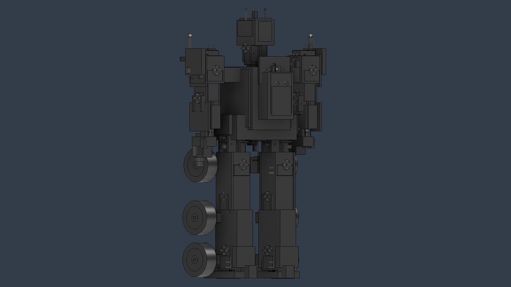 | 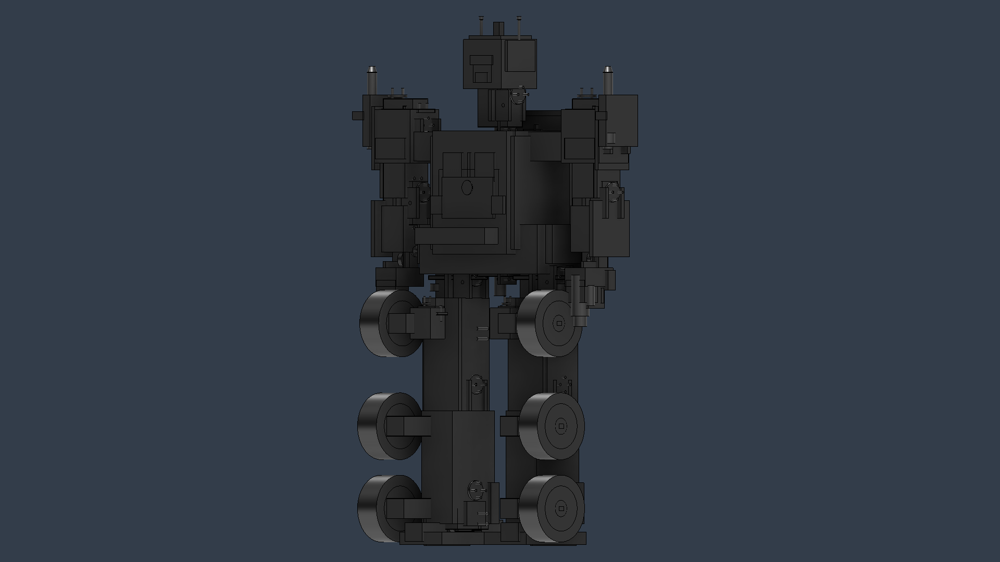 |

### Demo Videos


| Transformation | Truck Mode | Robot Mode |
|----------------|------------|------------|
| <video src="videos/Optimus_Prime_Transformation.mp4" controls width="100%" title="Optimus Prime - Transformation"></video> | <video src="videos/Optimus_Prime_Truck_Mode.mp4" controls width="100%" title="Optimus Prime - Truck Mode"></video> | <video src="videos/Optimus_Prime_Robot_Mode.mp4" controls width="100%" title="Optimus Prime - Robot Mode"></video> |

---

## What Is This?

This project is a **Python script** (`src/optimus_prime_g1_v9.py`) that connects to Autodesk Fusion 360 through its **MCP server** and automatically:

1. **Builds** a complete Optimus Prime G1 3D model with 100+ components
2. **Applies** materials (red/blue metallic paint, chrome, rubber, glass)
3. **Creates** all joints (revolute, ball, rigid) and validates the kinematic chain
4. **Runs** 9 simulation modules covering full-body motion
5. **Exports** STL files and a URDF skeleton for 3D printing and robotics toolchains

Zero external Python dependencies — uses only the **standard library**.

---

## Inspiration & Concept

This robot is inspired by **Optimus Prime**, the iconic leader of the Autobots from the **Transformers** franchise (created by Hasbro/Takara in 1984). The design draws from the **Generation 1 (G1)** aesthetic — the classic red-and-blue cab-over semi-truck that transforms into a battle-ready robot.

What makes this project unique:
- **First fully working 3D-printable Optimus Prime CAD model** with real servo kinematics
- **Complete transformation sequence** — Robot ↔ Truck with all 9 stages programmed
- **Realistic hardware** — every servo, bearing, bracket, and wire channel is modelled for actual fabrication
- **Open-source simulation** — runs entirely in Fusion 360 via MCP, no proprietary tools required

The model is designed as a **working prototype** — not just a static figure — with:
- **24 servo motors** controlling 18 joints across the full body
- **6 TT gear-motor wheels** for driving in truck mode
- **23 bearings**, **11 U-brackets**, **16 screw holes**, and **12 magnet pockets** for assembly
- **0.60 mm FDM clearance** on all moving parts for 3D printing

---

## Features

- **Full 3D model** — 100+ body components (torso, head, pelvis, arms, legs, backpack, ion blaster)
- **9 simulation modules** — ROM test, head scan, wave, breathing, walking, running, combat, transformation, stability
- **MCP-driven** — remote control via Fusion 360's Model Context Protocol
- **3D-printable** — 0.60 mm clearance, Y-axis midplane shell splitting, M3 screw holes, magnet pockets
- **Zero dependencies** — Python standard library only
- **CLI control** — run single modules, stop mid-simulation, capture screenshots

---

## Technical Specifications

### Hardware Inventory (Total: 114+ components)

| Component Type | Quantity | Details |
|---------------|----------|---------|
| **Servo Motors** | **24 total** | 18× MG996R (standard) + 6× MG90S (micro) |
| **TT Gear Motors** | **6** | Yellow gearbox + chrome motor body + rubber tire/wheel assemblies |
| **Bearings** | **23** | 5 sizes (ro 0.80–1.30) for hip, knee, shoulder, elbow, wrist, ankle, waist, roof, steer |
| **Screw Holes (M3)** | **16** | Pre-cut in torso, thighs, shins, upper arms, forearms |
| **Magnet Pockets** | **12** | Ø6.4 × 3.5 mm — waist lock, knee locks, roof lock |
| **Wire Channels** | **9** | Spine (ø12 mm), legs (ø10 mm), arms (ø8 mm) |
| **U-Brackets** | **11** | Waist (2), neck, hips (2), knees (2), shoulders (2), elbows (2) |
| **Joints** | **18 total** | 10 ball joints (3-DOF), 5 revolute (1-DOF), 3 rigid (0-DOF) |
| **Top-Level Assemblies** | **19** | Torso, head, pelvis, thighs, shins, feet, upper arms, forearms, hands, blaster, backpack, steer pods, shields |

### Servo Motor Breakdown

| Servo Model | Rating | Qty | Locations |
|-------------|--------|:---:|-----------|
| **MG996R-HD** (Heavy Duty) | 20.0–25.0 kg·cm | 3 | Waist yaw, waist pitch, (hip option) |
| **MG996R** (Standard) | 9.4 kg·cm | 15 | Hips, knees, ankles, shoulders, elbows |
| **MG90S** (Micro) | 1.8 kg·cm | 6 | Neck yaw, wrists (×2), roof hinge, steering (×2) |

| # | Servo Tag | Function | Component | Axis |
|---|-----------|----------|-----------|:----:|
| 1 | `Waist_Yaw` | Waist rotation | OP_Torso | z |
| 2 | `Waist_Pitch` | Waist tilt | OP_Torso | x |
| 3 | `Neck_Pitch` | Head nod | OP_Torso | x |
| 4 | `Neck_Yaw` | Head turn | OP_Head | z |
| 5–6 | `L/R_HipYaw` | Hip rotation | OP_Pelvis | z |
| 7–8 | `L/R_HipP` | Hip pitch (leg lift) | OP_Thigh | x |
| 9–10 | `L/R_HipR` | Hip roll (leg spread) | OP_Thigh | y |
| 11–12 | `L/R_KneP` | Knee bend | OP_Thigh | x |
| 13–14 | `L/R_ShY` | Shoulder yaw | OP_UpperArm | z |
| 15–16 | `L/R_ShP` | Shoulder pitch (arm lift) | OP_UpperArm | x |
| 17–18 | `L/R_ShR` | Shoulder roll | OP_UpperArm | y |
| 19–20 | `L/R_ElbP` | Elbow bend | OP_UpperArm | x |
| 21–22 | `L/R_WR` | Wrist rotation | OP_Forearm | x |
| 23 | `Roof_Hinge` | Backpack roof fold | OP_Backpack | x |
| 24–25 | `SSrv_L/R` | Steer pod steering | OP_SteerPods | z |

### TT Motor / Wheel Assembly (6 units)

| Wheel | Location | Component | Tire Size |
|-------|----------|-----------|:---------:|
| L/R Front Wheels | Shin front | OP_Shin_L/R | r=3.25 × w=2.60 |
| L/R Rear Wheels | Shin rear | OP_Shin_L/R | r=3.25 × w=2.60 |
| L/R Steer Wheels | Steer pods | OP_SteerPods | r=3.25 × w=2.60 |

Each assembly includes: yellow gearbox (2.30×5.20×1.90), chrome motor body (r=0.90), steel shaft (r=0.20), chrome rim (r=2.20), rubber tire (r=3.25).

### Servo Load Analysis

| Joint | Load Mass | Lever Arm | Torque Needed | Servo Used | Rating | Margin |
|-------|:---------:|:---------:|:-------------:|:-----------:|:-----:|:------:|
| Waist Pitch | 2100 g | 8.0 cm | 16.8 kg·cm | MG996R-HD | 25.0 kg·cm | **1.49x** |
| Hip Pitch | 820 g | 15.0 cm | 12.3 kg·cm | MG996R-HD | 20.0 kg·cm | **1.63x** |
| Knee Pitch | 540 g | 9.0 cm | 4.86 kg·cm | MG996R | 9.4 kg·cm | **1.93x** |
| Shoulder Pitch | 390 g | 12.0 cm | 4.68 kg·cm | MG996R | 9.4 kg·cm | **2.01x** |
| Elbow | 210 g | 7.0 cm | 1.47 kg·cm | MG996R | 9.4 kg·cm | **6.39x** |
| Neck Pitch | 120 g | 3.0 cm | 0.36 kg·cm | MG90S | 1.8 kg·cm | **5.00x** |

All joints operate with **≥1.49x safety margin** — verified through simulation.

### Vertical Layout (Z-axis spacing — model units)

| Section | Z Position | Height from Ankle |
|---------|:----------:|:-----------------:|
| Ankle Center | 3.8 | 0.0 (base) |
| Shin Center | 9.3 | +5.5 |
| Knee Center | 14.8 | +11.0 |
| Thigh Center | 20.3 | +16.5 |
| Pelvis Center | 30.5 | +26.7 |
| Waist Center | 32.5 | +28.7 |
| Hip Joint | 26.8 | +23.0 |
| Torso Center | 36.0 | +32.2 |
| Elbow | 35.0 | +31.2 |
| Shoulder Center | 41.5 | +37.7 |
| Neck Joint | 44.5 | +40.7 |
| Head Center | 47.5 | +43.7 |

Overall height: **~47.5 cm** (approx. 19 inches, 1:10 scale).

### Materials & Appearance (12 finishes)

| Material | RGB / Look | Used On |
|----------|-----------|---------|
| Op-Red (Metallic) | Red paint | Torso shell, thighs, feet, forearms, backpack |
| Op-Blue (Metallic) | Blue paint | Pelvis, shins, helmet, shoulder guards, hip shields |
| Chrome | Mirror chrome | Grille, bumpers, faceplate, exhausts, rims, badge |
| Dark Metal | Steel flat | Inner frame, blaster body, thigh links, exhaust blocks |
| Glass Clear | Window glass | Chest windows, headlights, visor |
| Rubber Black | Matte rubber | Tires |
| Grey Plastic | Matte grey | Hands, fingers |
| Dark Grey | Matte dark grey | Backpack core, steer pods, hinge blocks |
| Black Plastic | Matte black | Battery bay, controller bay |
| Gold | Metallic gold | Antenna tips |
| Yellow Metallic | Yellow paint | TT gearbox housings |
| White Plastic | Glossy white | Servo horns |

---

## Requirements

- **Autodesk Fusion 360** with MCP server running on `http://127.0.0.1:27182/mcp`
- **Python 3.8+** (standard library only — no extra packages needed)

---

## Setup & Running

### 1. Enable MCP Server in Fusion 360

The MCP (Model Context Protocol) server must be running in Fusion 360 before you can run the simulation.

**Fusion 360 v19.0+ (Built-in MCP):**
1. Open Fusion 360
2. Go to **Tools → Scripts and Add-Ins** (or press `Shift+S`)
3. Select the **MCP Server** entry and click **Run**

**Alternatively, command line (PowerShell):**
```powershell
& "C:\Program Files\Autodesk\Fusion 360\FusionLauncher.exe" --mcp
```

**Verify MCP is running:** Open a browser and navigate to `http://127.0.0.1:27182/mcp` — you should see a JSON-RPC response.

### 2. Clone and Run

```bash
# Clone the repo
git clone https://github.com/itsPremkumar/Optimus_Prime.git
cd Optimus_Prime

# Full simulation (all 9 modules)
python src/run_simulation.py

# Single module
python src/run_simulation.py --module walk

# Capture screenshots during simulation
python src/run_simulation.py --capture

# Run robot standing pose
python src/run_simulation.py --module robot

# Run truck mode transformation
python src/run_simulation.py --module truck --capture

# Stop a running simulation
python src/run_simulation.py --stop
```

> **Note:** On first run, `run_simulation.py` will auto-detect and launch Fusion 360 if it's not already running. The MCP server typically takes 30–60 seconds to become available.

### 3. CLI Options

| Option | Default | Description |
|--------|---------|-------------|
| `--module` | `ALL` | Module to run: `ALL`, `rom`, `head`, `wave`, `breathing`, `walk`, `run`, `combat`, `transform`, `truck`, `robot`, `stability`, `servo` |
| `--capture` | off | Capture 6 multi-angle viewport screenshots (Front, Back, Left, Right, Top, Isometric) |
| `--mcp-url` | `http://127.0.0.1:27182/mcp` | Custom MCP server URL |
| `--no-launch` | off | Skip auto-launch of Fusion 360 (use if manually started) |
| `--keep-docs` | off | Keep existing documents open (default closes all documents first) |
| `--stop` | off | Stop a running simulation via flag file |

### 4. How MCP Communication Works

The system uses **JSON-RPC 2.0** over HTTP to communicate with Fusion 360's built-in MCP server:

```
┌─────────────┐     HTTP POST (JSON-RPC)     ┌──────────────┐
│  Your PC    │ ──────────────────────────▶  │ Fusion 360   │
│  run_sim.py │                               │ MCP Server   │
│  (Python)   │ ◀──────────────────────────  │ (127.0.0.1)  │
└─────────────┘     Script result + logs     └──────┬───────┘
                                                    │
                                           ┌────────▼────────┐
                                           │ adsk.core /     │
                                           │ adsk.fusion API │
                                           │ (Fusion 360)    │
                                           └─────────────────┘
```

**Step-by-step flow:**
1. `run_simulation.py` connects to the MCP server at `http://127.0.0.1:27182/mcp`
2. Sends an `initialize` JSON-RPC request to establish a session
3. Closes any open documents (via embedded prologue script)
4. Sends the `optimus_prime_g1_v9.py` payload via `fusion_mcp_execute` tool call
5. Fusion 360 executes the script using its internal Python API (`adsk` modules)
6. The script builds the model, runs the selected module, and captures output
7. Results (logs, screenshots, exports) are written to the `output/` directory
8. `run_simulation.py` prints the execution log returned by Fusion

**Key details:**
- MCP sessions persist across requests — a session ID is stored after initialization
- The payload script runs with full Fusion 360 API privileges (same as Scripts & Add-Ins)
- Timeout is set to 3600 seconds (1 hour) for long simulations
- If a dialog is blocking execution, Escape key is sent to dismiss it and the script retries

---

## Project Structure

```
Optimus_Prime/
├── src/                           # Source code
│   ├── optimus_prime_g1_v9.py     # Main Fusion 360 script (model + simulation engine)
│   ├── optimus_prime_g1_v8.py     # Previous version (v8 — reference only)
│   ├── optimus_prime_g1_v7.py     # Previous version (v7 — reference only)
│   ├── run_simulation.py          # CLI controller — sends the script to Fusion 360
│   ├── capture_optimus.py         # Multi-angle viewport screenshot capture
│   ├── analyze_bugs.py            # Post-simulation collision and bug analysis
│   └── api_test.py                # Dev utility to query Fusion 360 API
├── archive/                       # Archived legacy versions
│   └── optimus_prime_simulation_v6.py
├── images/                        # Saved viewport screenshots
├── videos/                        # Demo videos (transformation, truck mode, robot mode)
├── .github/                       # GitHub issue/PR templates
├── CHANGELOG.md                   # Version history
├── CODE_OF_CONDUCT.md             # Community standards
├── CONTRIBUTING.md                # Contribution guidelines
├── LICENSE                        # MIT License
├── README.md                      # Project overview and usage
├── SECURITY.md                    # Security policy
└── .gitignore
```

### Simulation Modules

| # | Module | Duration | Description | Key Angles |
|---|--------|:--------:|-------------|:-----------|
| 1 | **Joint ROM Test** | ~30s | Sweeps every joint min→0→max, samples collisions at each extreme | All joints full range |
| 2 | **Head Look-Around** | ~8s | 5-position scan (left, right, up, down, centre) | Neck yaw ±20°, pitch ±45° |
| 3 | **Wave Gesture** | ~10s | Full right-arm raise and 3× wrist wave | ShP -90°, Elbow 90°, Wrist ±90° |
| 4 | **Idle Breathing** | ~12s | 4-cycle subtle torso oscillation (waist pitch ±2°) | Waist pitch ±2° |
| 5 | **Advanced Walking** | ~20s | 4 cycles with hip sway, arm counter-swing, ankle push-off | Hip ±30°, Knee 0→60°, Ankle ±15° |
| 6 | **Running** | ~15s | 3 cycles, exaggerated fast gait | Hip ±45°, Knee 0→90°, faster cadence |
| 7 | **Combat Sequence** | ~12s | Right cross → blaster aim → forearm block → left uppercut | Multi-axis arm & torso |
| 8 | **Transformation** | ~30s | Robot → Truck (9 stages) + driving + reverse transformation | All joints coordinated |
| 9 | **Stability + Loads** | ~5s | CoM check for 4 poses + static servo torque table | Attention/Combat/Squat/Victory |

### Capture Screenshots

```bash
python src/capture_optimus.py
```

Saves 6 viewport renders (Front, Back, Left, Right, Top, Isometric) to `images/`.

Truck mode renders: `optimus_truck_Front.png`, `optimus_truck_Back.png`, `optimus_truck_Left.png`, `optimus_truck_Right.png`, `optimus_truck_Top.png`, `optimus_truck_Iso.png`.

---

## Model Overview

### Body Components (19 Assemblies, 140+ Bodies)

| Component | Bodies | Key Parts | Color Scheme |
|-----------|:------:|-----------|:------------:|
| **OP_Torso** | 42 | Shell, chest windows (glass), grille (chrome), bumper, headlights, battery bay, spine beam, controller bay, collars, transformation flaps | Red/Blue/Chrome |
| **OP_Head** | 15 | Helmet, crest, ears, faceplate (chrome), visor (glass), mouth grille, antennas with gold tips | Blue/Chrome/Gold |
| **OP_Pelvis** | 7 | Pelvis shell, inner frame, hip armour (L/R), crotch plate | Blue/Chrome/Red |
| **OP_Thigh (×2)** | ~13 each | Thigh link (chrome), outer shell (red), front plate (blue), 2× bearings | Red/Blue/Chrome |
| **OP_Shin (×2)** | ~10 each | Shin link (blue), armour (chrome), rear panel (grey), beam, foot tuck cavity, bearings | Blue/Chrome/Grey |
| **OP_Foot (×2)** | ~8 each | Sole (red), heel block (grey), toe block (grey), ankle guard (chrome), boot fin (blue) | Red/Grey/Chrome |
| **OP_UpperArm (×2)** | ~13 each | Shoulder block (red), guard (blue), exhaust stacks (chrome), link (red) | Red/Blue/Chrome |
| **OP_Forearm (×2)** | ~6 each | Forearm link (blue), fender (red), back panel (chrome) | Blue/Red/Chrome |
| **OP_Hand (×2)** | ~4 each | Palm (grey), fingers (grey), thumb (chrome), hand panel (red) | Grey/Chrome/Red |
| **OP_Ion_Blaster** | 6 | Barrel (metal), tip (chrome), body (metal), guard (chrome), hinge, scope | Dark Metal/Chrome |
| **OP_Backpack** | 8 | Core (grey), hood (red), top flap (red), radiator (chrome), exhausts ×2 | Red/Grey/Chrome |
| **OP_SteerPods** | ~7 | Steer arms (chrome) ×2, steer pods (grey) ×2, steer wheels ×2 | Chrome/Grey |
| **OP_Shields** | 8 | Shoulder shields (chrome) ×2, hinges ×2, mirrors ×2, hip shields (blue) ×2 | Chrome/Blue |

### Kinematic Tree (Joint Hierarchy)

```
Grounded: OP_Pelvis
  ├── OP_Torso (ball_joint: Waist_Cluster @ z=30.0)
  │   ├── OP_Head (ball_joint: Neck_Cluster @ z=44.5)
  │   ├── OP_Backpack (rigid_joint: Backpack_Mount)
  │   ├── OP_Shields (rigid_joint: Shields_Mount)
  │   ├── OP_UpperArm_L (ball_joint: L_Shoulder_Cluster @ z=41.5)
  │   │   └── OP_Forearm_L (revolute_joint: L_Elbow @ z=35.0)
  │   │       └── OP_Hand_L (ball_joint: L_Wrist @ z=29.8)
  │   └── OP_UpperArm_R (ball_joint: R_Shoulder_Cluster @ z=41.5)
  │       └── OP_Forearm_R (revolute_joint: R_Elbow @ z=35.0)
  │           └── OP_Hand_R (ball_joint: R_Wrist @ z=29.8)
  │               └── OP_Ion_Blaster (revolute_joint: Blaster_Fold)
  ├── OP_SteerPods (rigid_joint: Steer_Mount)
  ├── OP_Thigh_L (ball_joint: L_Hip_Cluster @ z=26.8)
  │   └── OP_Shin_L (revolute_joint: L_Knee @ z=16.3)
  │       └── OP_Foot_L (ball_joint: L_Ankle_Cluster @ z=6.0)
  └── OP_Thigh_R (ball_joint: R_Hip_Cluster @ z=26.8)
      └── OP_Shin_R (revolute_joint: R_Knee @ z=16.3)
          └── OP_Foot_R (ball_joint: R_Ankle_Cluster @ z=6.0)
```

### Joint Classification & Limits

| Joint | Type | DOF | Limits (Pitch/Yaw/Roll) | Servo Group |
|-------|:----:|:---:|:------------------------|:-----------:|
| Waist_Cluster | Ball | 3 | (-45,60) / (-15,15) / (-15,15) | 2× MG996R-HD |
| Neck_Cluster | Ball | 3 | (-90,45) / (-20,20) / (-20,20) | MG996R + MG90S |
| L/R_Hip_Cluster | Ball | 3 | (-30,30) / (-95,95) / (-30,30) | 2× MG996R-HD + MG996R |
| L/R_Knee | Revolute | 1 | (0,135) | MG996R |
| L/R_Ankle_Cluster | Ball | 3 | (-20,20) / (-30,95) / (-20,20) | MG996R |
| L/R_Shoulder_Cluster | Ball | 3 | (-175,60) / (-90,90) / (-90,90) | 2× MG996R |
| L/R_Elbow | Revolute | 1 | (0,150) | MG996R |
| L/R_Wrist | Ball | 3 | (0,90) / (-180,180) — pitch/roll | MG90S |
| Blaster_Fold | Revolute | 1 | (-90,0) | — |

### 3D Printing Specifications

- **Clearance**: 0.60 mm on all moving fits (FDM-optimized, increased from 0.45 mm in v7)
- **Shell Splitting**: All major bodies halved along Y-axis midplane for FDM printing
- **Auto-split tags**: `Shell`, `Link`, `Main`, `Armor`, `Core`, `Pod`, `Palm`, `Block`, `Sole`
- **Fasteners**: M3 screw holes (r=0.15 model units, 16 locations)
- **Magnets**: Ø6.4 × 3.5 mm pockets (12 locations) for snap-fit assembly
- **Wire Channels**: Pre-cut tunnels (ø8–12 mm) for servo cable routing through spine, arms, and legs
- **Shrinkage**: Apply FDM shrinkage compensation in slicer (typical 0.5–1.0%)

---

## Output Files

| File | Description |
|------|-------------|
| `output/logs/optimus_fusion_log_*.txt` | Timestamped execution log with all module results and collision details |
| `output/exports/robot.urdf` | Minimal URDF skeleton for robotics toolchain import (ROS, Gazebo, etc.) |
| `output/exports/Optimus_Prime_G1_v9.f3d` | Fusion 360 archive of the full model |
| `output/exports/Optimus_Prime_G1_v9.step` | STEP assembly file for CAD import (SolidWorks, CATIA, FreeCAD, etc.) |
| `output/screenshots/*.png` | Viewport screenshots (1920×1080) from `capture_optimus.py` |

> **Export flags** are controlled at the top of `src/optimus_prime_g1_v9.py`:
> - `EXPORT_STL = True/False` — batch export all printable bodies as `.stl`
> - `EXPORT_STEP = True/False` — export full assembly as `.step`
> - `EXPORT_URDF = True/False` — export kinematic skeleton as `.urdf`

---

## Advanced Use Cases

### Robotics Education & Prototyping
- **Kinematic validation**: Verify joint ranges, torque requirements, and stability before building the physical robot
- **Servo sizing**: The integrated load analysis table helps select correct servo ratings for each joint
- **Gait development**: Design and test walking gaits, running cycles, and transformation sequences in simulation before deploying to hardware
- **Collision detection**: Joint ROM test sweeps every axis and records collision events at extreme poses

### 3D Printing & Fabrication
- **Ready-to-print STLs**: Set `EXPORT_STL = True` to batch-export all bodies as individual `.stl` files
- **STEP export**: Export full assembly as `.step` for professional CAD/CAM workflows (CNC machining, injection molding)
- **FDM-optimized**: 0.60 mm clearance on all joints, Y-axis midplane shell splitting, M3 screw holes, magnet pockets, and wire channels pre-integrated
- **Hardware integration**: Every servo cavity, bearing seat, and bracket is modelled with exact clearance — no manual fitting required

### Robotics Research
- **URDF export**: The kinematic skeleton exports as `.urdf` for use with ROS, Gazebo, MoveIt, or your own simulation framework
- **Modular architecture**: Each body part is a separate component — swap, modify, or replace individual sections without affecting the assembly
- **Parameter-driven**: All dimensions, clearances, servo specs, and joint limits are defined as constants at the top of the script — tweak and regenerate in seconds

### Full-Stack Robotics Pipeline
```
Fusion 360 (MCP) → CAD model → STEP/STL export → 3D printing / CNC
                             → URDF export → ROS simulation → hardware control
                             → F3D archive → version control → collaboration
```

---

## 3D Printing Notes

- Clearance on all moving fits: **0.60 mm**
- All major shells are split along the Y-axis midplane for FDM printing
- Bodies tagged with `Shell`, `Link`, `Main`, `Armor`, `Core`, `Pod`, `Palm`, `Block`, or `Sole` are automatically halved
- Screw holes (M3), magnet pockets (Ø6.4 × 3.5 mm), and wire channels are pre-cut into the geometry
- Apply shrinkage compensation in your slicer before printing

---

## Frequently Asked Questions

### What is Optimus Prime G1?
Optimus Prime is the iconic leader of the Autobots from the Transformers franchise. The "G1" refers to the **Generation 1** design from the 1980s — the classic red-and-blue truck form.

### Does this work without Fusion 360?
No. This script runs **inside Autodesk Fusion 360** via its MCP server. It is not a standalone simulation.

### Can I 3D print the robot?
Yes. The model is designed for **FDM 3D printing** with 0.60 mm clearance on all moving fits, shell splitting along the midplane, M3 screw holes, and magnet pockets (Ø6.4 × 3.5 mm).

### What Python packages are required?
**None.** The project uses only Python's **standard library** (`urllib`, `json`, `os`, `argparse`). The Fusion 360 script uses the `adsk` API which is built into Fusion 360.

### How do I run only one simulation module?
Use `--module` flag: `python run_simulation.py --module walk`

### What is MCP?
**Model Context Protocol** (MCP) is a JSON-RPC 2.0 protocol built into Fusion 360 that allows external applications (like this Python script) to communicate with Fusion 360 remotely. The MCP server listens on `http://127.0.0.1:27182/mcp` and can execute scripts, query the model, and control the viewport. See the [Setup & Running](#setup--running) section above for how to enable it.

### How do I stop a simulation mid-run?
Run `python run_simulation.py --stop` from another terminal. This creates a flag file that the simulation checks every frame.

### How many servos does the robot use?
**24 total**: 18× MG996R standard servos (9.4 kg·cm) for hips, knees, ankles, shoulders, elbows + 6× MG90S micro servos (1.8 kg·cm) for neck yaw, wrists, roof hinge, and steering.

### How does the transformation work?
The transformation sequence moves through 9 stages: legs fold, knees retract, torso compresses, arms reposition, backpack opens, panels rotate, and the robot compacts into truck mode. The reverse sequence restores robot mode.

### Can I export the model for other CAD tools?
Yes. Set `EXPORT_STEP = True` to generate a `.step` file compatible with SolidWorks, CATIA, FreeCAD, Onshape, and other CAD tools. STL export for 3D printing and URDF for robotics toolchains are also supported.

### Is this a real working robot or just a simulation?
This is a **kinematic simulation** in Fusion 360 — all joints, motors, and transformations are animated digitally. The model is designed to be **3D-printable** and includes all hardware provisions (servo cavities, bearings, screws, magnets, wire channels) for building a physical replica.

### How long does the full simulation take?
The complete 9-module simulation runs in approximately **2–3 minutes** in Fusion 360, depending on system performance. Individual modules run in 5–30 seconds.

---

## Contributing

We welcome contributions! See [CONTRIBUTING.md](CONTRIBUTING.md) for guidelines.

Please adhere to the [Code of Conduct](CODE_OF_CONDUCT.md) in all interactions.

## License

This project is licensed under the MIT License — see the [LICENSE](LICENSE) file for details.

---

<div align="center">
  <sub>
    Built with Python &middot; Powered by Autodesk Fusion 360 &middot;
    <a href="https://github.com/itsPremkumar/Optimus_Prime">GitHub</a>
  </sub>
</div>


uv run src/run_simulation.py --module truck --capture