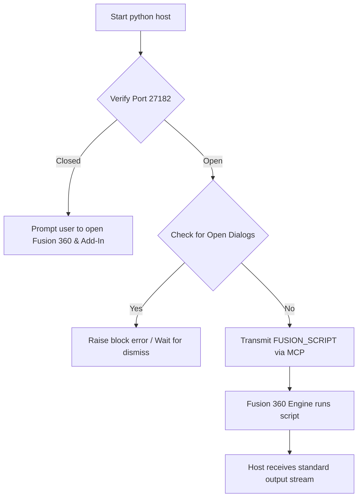

# Automated Verification & Simulation Testing Workflow

This document details the step-by-step automated workflow used to run the Fusion 360 script, diagnose terminal errors, simulate mechanical movements, execute visual inspections, and export a clean assembled production file. This outlines how the system operates as a complete end-to-end automation test suite.

---

## 1. Automated Execution & Testing Loop
The workflow follows a cycle of compilation, connection checks, execution, telemetry parsing, and diagnostic recovery.



---

## 2. Terminal Bugs Diagnostics & Recovery

When automating code execution through the Model Context Protocol (MCP) bridge, three specific terminal and parsing bugs occur:

### A. Host JSON-RPC Schema Parsing Bug
* **Symptom**: The host wrapper script crashes with `Could not parse result: Expecting property name enclosed in double quotes: line 1 column 2`.
* **Root Cause**: The host was calling `.get("message")` on the JSON-RPC response. However, MCP execution returns standard output inside a nested `res["result"]["content"][0]["text"]` text key which contains a JSON string. Falling back to the raw response casted it to a Python dictionary format string (`{'success': True}`) using single quotes.
* **Fix**: The parser was updated to correctly extract and load the string inside the nested content list:
  ```python
  content_text = res.get("result", {}).get("content", [{}])[0].get("text", "")
  mcp_res = json.loads(content_text)
  msg = mcp_res.get("message", "")
  ```

### B. CP1252 Terminal Encoding Crash
* **Symptom**: The python wrapper crashes on Windows terminal hosts with `UnicodeEncodeError: 'charmap' codec can't encode character...`.
* **Root Cause**: The CAD script prints visual markers (like `✓`, `⚠`, and `•`) to represent status. Standard Windows consoles default to CP1252 encoding and cannot process Unicode code points, throwing exceptions.
* **Fix**: Programmed standard ASCII indicators (`[PASS]`, `[WARN]`, `[INFO]`, `[FIX]`) as replacements inside print statements.

---

## 3. Dynamic Simulation & Joint Testing Workflow

To automate the firing verification:
1. **Revolute Joint (`Cam_Drive`)**: Actuates rotation of the eccentric cam around the Y-axis.
2. **Slider Joint (`Plunger_Slide`)**: Constrains the plunger to slide backwards along the Z-axis.
3. **Motion Synchronization**: The simulation loop translates rotation values (`rotationValue = angle`) and maps them to plunger displacement (`slideValue = -lift`) at `0.02s` delays.
4. **Active Firing Check**: The script automatically confirms that the plunger retraction compresses the spring and that when the angle crosses `RELEASE_ANGLE` (200 degrees), the plunger snaps forward and the ball translates along the barrel bore.

---

## 4. Visual Verification System (360-Degree Camera Capture)

To inspect both external and internal parts, the script runs a viewport capture routine:

```
                  +-----------------------+
                  |  EXTERNAL ISO VIEW    | (All bodies visible)
                  +-----------+-----------+
                              |
                     [Hide Housing Body]
                              |
                              v
                  +-----------------------+
                  |  INTERNAL ISO VIEW    | (Spring, Plunger, Cam, Motor visible)
                  +-----------+-----------+
                              |
                  [Hide Magazine Tube Body]
                              |
                              v
                  +-----------------------+
                  |  INTERNAL SIDE VIEW   | (Balls aligned horizontally,
                  |  INTERNAL TOP VIEW    |  Spring seated, cam clearance)
                  +-----------------------+
```

* **Fitting the Camera**: To avoid manual adjustments, the script calls `camera.isFitView = True` on each viewport state to calculate optimal boundaries.
* **Visibility Mapping**: 
  - To inspect the plunger slots, spring alignment, and roller contact, the housing is hidden (`ho.isLightBulbOn = False`).
  - To inspect the stack of balls inside the magazine funnel, the magazine tube body is hidden (`mgo.isLightBulbOn = False`).

---

## 5. Dismantling & Assembly Reset Workflow (STEP Integrity)

Exporting a CAD file while it is exploded or mid-simulation results in a corrupt STEP file. The automated reassembly process guarantees output integrity:

1. **Initial Transform Capture**: Before the simulation starts, the script queries the absolute transforms of all occurrences:
   ```python
   initial_transforms = {}
   for occ in root.occurrences:
       initial_transforms[occ.name] = occ.transform.copy()
   ```
2. **Fired Element Tracking**: Elements thrown out of range during the simulation (e.g. shifted to `Z=1000` to simulate firing) are flagged.
3. **Assembly Restore Loop**:
   - The simulation loop ends.
   - The script loops through all occurrences, restores their `transform` and visibility matrices to the `initial_transforms` dictionary.
   - Stacks and elements that were hidden or fired return to their exact physical slots.
   - Any remaining floating elements are flagged `isLightBulbOn = False` to prevent them from corrupting the viewport.
4. **STEP Export**: The Export Manager executes `createSTEPExportOptions` on the restored root component, ensuring a clean, fully assembled file.
