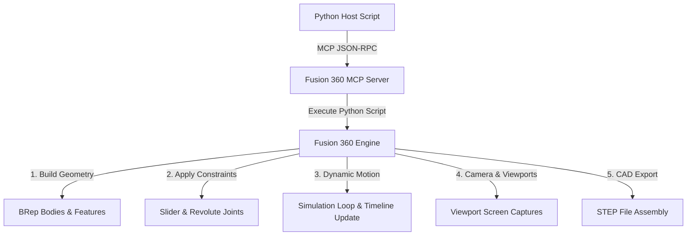

# Ball Launcher Development & Verification Workflow Documentation

This document outlines the workflow, architectural fixes, and automated visual verification system designed to build, simulate, and export the 3D-printable Ball Launcher inside Autodesk Fusion 360. This is structured as a guide for replicating similar automated CAD workflows in the future.

---

## 1. Workflow Architecture Overview
The system bridges a local python execution script with the running Autodesk Fusion 360 environment using a Model Context Protocol (MCP) server running on port `27182`. 



---

## 2. Key Geometrical & Mechanical Bugs Solved

### A. Coordinate System Reversion (Joint Solver Reset)
* **The Problem**: When translating occurrences directly in component space (such as placing balls in the magazine stack), Fusion 360 treats these as uncaptured temporary positions. As soon as the joint solver evaluates or `adsk.doEvents()` runs, all occurrences revert to their default base position `(0, 0, 0)`.
* **The Fix**: Balls are now created at the origin, and then translated *after* the joints are successfully built. Immediately after translating the balls, `design.snapshots.add()` is called. This bakes the positions into the design timeline, preventing the joint solver from resetting them to the origin.

### B. Viewport Zoom Bounding Box (Floating Element Bug)
* **The Problem**: During the firing simulation, fired balls are translated far away (e.g., to `(1000, 1000, 1000)`) to simulate exit. When the camera fits the view (`camera.isFitView = True`), Fusion 360 calculates the bounding box of the entire model including these far-away elements. This causes the main launcher assembly to appear as a tiny, unreadable dot.
* **The Fix**: Added an assembly cleanup step at the end of the simulation. A dictionary copies initial transforms and visibilities before the simulation. At `ASSEMBLY_START`, it loops through all occurrences to restore their correct positions and sets the visibility `isLightBulbOn = False` for any elements still translated out of bounds before calling `isFitView`.

### C. Cut Extrusion Failures (Spring Pocket & Holes)
* **The Problem**: The spring pocket cut failed with `No target body found` because the extrusion was cutting in the positive Z direction from the face of the cap, missing the solid body below it.
* **The Fix**: Extrusions intended as cuts must cut *into* target bodies. We configured the spring pocket cut depth to be negative (`-0.20` cm) so it cuts downwards directly into the solid 3mm rear cap body.

---

## 3. Automated Visual Verification System
To verify the inside functions of the model without manual section analysis, we programmed an automated camera capturing system directly into the CAD script.

### A. Viewport Capture API
Fusion 360’s API allows programmatically configuring the viewport camera and saving images to disk:
```python
view = _app.activeViewport
camera = view.camera
camera.cameraType = adsk.core.CameraTypes.OrthographicCameraType
camera.viewOrientation = adsk.core.ViewOrientations.IsoTopRightViewOrientation
camera.isFitView = True
view.camera = camera
view.refresh()
view.saveAsImageFile(path, 1200, 900)
```

### B. Occlusion Removal (Hiding Components)
To check the internal mechanics, the code selectively hides components to bypass visual blockages:
* **Housing body hidden**: Allows checking the alignment of the plunger shaft, spring seating, and eccentric cam contact.
* **Magazine tube body hidden**: The transparent magazine tube was rendering opaque in standard viewport mode. Hiding the magazine component (`mgo.isLightBulbOn = False`) allowed the visual capture of the 5 stacked magazine balls to ensure they are centered on the drop funnel.

---

## 4. Reassembly & STEP Export Integrity
For 3D printing, the parts must be exported in their correct assembled positions.
* **Explode Disables**: Disassembly animations translate occurrences. We disabled translation displacements during exports.
* **Chronological Restore**: The script fully restores `initial_transforms` and snapshots the final design before initiating the STEP Export Manager.

---

## 5. Guidelines for Future Scripted CAD Workflows
1. **Always build first, joint second, translate/snapshot third**: Keep joints independent of temporary occurrence translations.
2. **Use Relative Cuts**: When executing cuts, ensure the thickness of the body is greater than the cut depth, and verify vector directions.
3. **Save Viewport states**: Program 3-4 orthographic perspectives in your scripts to allow instantaneous visual checks without loading the CAD UI manually.
